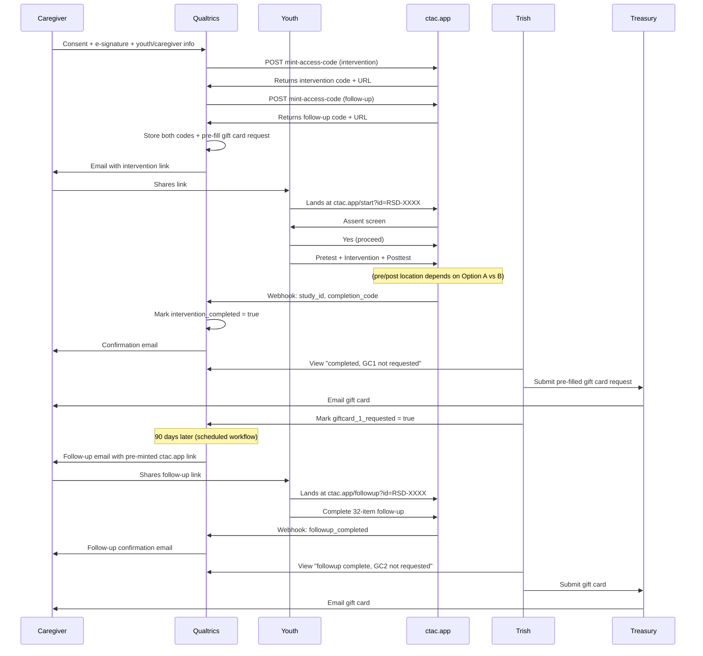

# Ready for Roots Full Participant Flow Design

> Filename retains the legacy `RSD_` prefix — internal-artifact rule (see Draft 14 rename, 2026-05-13). User-facing program name is **Ready for Roots**.

**Project:** Ready for Roots (formerly *Ready! Set! Dedicate!* / RSD) / Belongingness SSGMI
**Last updated:** 2026-05-06 (rev 5 — two-codes design adopted from Claude Code review)
**Audience:** Friday IFR meeting (Jessica, Dr. Sprang, Stephanie, Trish, Josh)
**Purpose:** Capture the full end-to-end participant flow as a meeting handout, with one open decision flagged for the team to resolve.

---

## What's decided

- **Consent + assent platform:** Qualtrics. Lab standard for SSIs. Avoids platform sprawl.
- **Intervention platform:** ctac.app (custom application on Vercel + Supabase).
- **Link delivery to youth:** caregiver-mediated. After consent, Qualtrics emails the caregiver a link, and the caregiver provides it to the youth.
- **Identity tracking:** a study ID generated at consent (e.g., `RSD-2026-0042`) flows through every system. No code-entry burden on caregivers or youth — the ID is embedded in the URLs.
- **Webhook-based completion tracking:** ctac.app posts to Qualtrics on each completion event. Mechanism technically validated 2026-05-05 (test workflow successful).
- **Gift card delivery:** UK Treasury issues e-gift cards via email to the caregiver's address. Trish processes from a saved Qualtrics view. $25 after intervention completion + $25 after follow-up = $50 total per completer.
- **Follow-up survey location:** ctac.app. Keeps measurement in a single program for unified export.
- **Data export to SPSS:** ctac.app already ships a Wide / SPSS-ready export with codebook (zero JSON cells, integer columns per Likert/VAS item). Sprang demo planned to confirm this addresses her analysis-pipeline concern.
- **Access code architecture:** two single-use codes per participant — one for the intervention, one for the 90-day follow-up — tied together by an `external_ref` column on `access_codes` storing the Qualtrics response ID. Both codes are minted at consent time via a new `mint-access-code` edge function called from Qualtrics. Confirmed against ctac.app's existing access code system; design comes from Claude Code review on 2026-05-06.
- **Two interventions in ctac.app:** the existing `ready-set-dedicate` intervention plus a new `rsd-follow-up-90d` intervention. The follow-up intervention is the 32 follow-up survey items only — no additional content, no reflection prompts.

---

## What's still open (decision needed Friday)

**Where do the pretest and posttest live?**

Two options on the table. The architectural skeleton is the same either way — only the platform for the pre/post survey items changes.

### Option A — Pretest and posttest in Qualtrics

Flow segment:
- Qualtrics: consent → pretest (32 items) → email caregiver with link to ctac.app
- ctac.app: intervention (videos + activities) → posttest (31 items) — wait, this doesn't quite work cleanly. *Actually under Option A, the posttest also lives in Qualtrics, which means a redirect at the end of the intervention back to Qualtrics for the posttest.*

Revised: under Option A, the redirects are: Qualtrics (consent + pretest) → ctac.app (intervention) → Qualtrics (posttest) → Qualtrics auto-emails caregiver confirmation → triggers gift card.

**Pros**
- Survey data stays in Qualtrics where the lab's analysis pipeline already lives.
- ctac.app focuses only on the intervention itself.
- No new code needed for Likert/VAS items beyond what's already shipped.

**Cons**
- Two platform handoffs in one session (Qualtrics → ctac.app → Qualtrics). Each handoff is a redirect the youth has to navigate through.
- Stephanie has flagged a clinical concern about missingness from handoffs, particularly with this population.
- Survey data and intervention engagement data live in two different systems.

### Option B — Pretest and posttest in ctac.app

Flow segment:
- Qualtrics: consent → email caregiver with link to ctac.app
- ctac.app: pretest → intervention → posttest (one continuous session)
- ctac.app posts webhook to Qualtrics on completion
- Qualtrics auto-emails caregiver confirmation, triggers gift card

**Pros**
- Single seamless session for the live experience.
- Matches Stephanie's "single program" preference.
- Aligns with the master plan / 004 intervention flow which already treats pretest and posttest as items.
- All pre/post/follow-up measurement data exports through the same SPSS-ready CSV — uniform pipeline.
- Trauma-informed design system (pacing, language, palette) applies consistently to assessment items as well as activities.

**Cons**
- Survey data lives in ctac.app's backend (Supabase), not Qualtrics. Sprang's analysis pipeline needs to consume the SPSS-ready export instead of native Qualtrics export — the export feature already ships, but Sprang should walk through the demo before committing.
- Adding or modifying scales later requires a code change rather than a Qualtrics edit. (At pilot scale this is fine; at scale it's a tradeoff.)

### Honest framing of the trade

The two options are not equivalent in difficulty or speed, but at this point neither has a clear empirical advantage at N=20:

- **Sprang's data-export concern** is now demonstrably resolved by the shipped export feature, regardless of which option is chosen.
- **Stephanie's missingness concern** has clinical weight from her experience with this population, but at N=20 the difference between options would not be statistically detectable.
- **Build cost** is lower than initially estimated — the export description shows ctac.app already supports the relevant item types (Likert, VAS, single-choice, multi-choice).

A reasonable group decision can be made on values (single-program continuity vs split-platform separation), not on quantitative evidence. This is a Sprang call as PI.

---

## Systems and roles

| System / Person | Role |
|---|---|
| **Qualtrics** | Owns consent, assent, caregiver name + email, youth name, study ID assignment, gift card request fields, and completion tracking. Source of truth for participant identity. Hosted at uky.pdx1.qualtrics.com. |
| **ctac.app** | Owns intervention delivery, custom activities, the 90-day follow-up survey, and (under Option B) the pretest/posttest. De-identified by design — only ever sees the study ID. Hosted on Vercel; backend Supabase. |
| **Caregiver** | Provides consent in Qualtrics, receives intervention link by email, shares link with youth, receives confirmation emails and gift cards. |
| **Youth** | Provides assent on entering ctac.app, completes the intervention (and follow-up at 90 days). |
| **Trish** (UK business manager) | Monitors Qualtrics filtered view. Submits gift card requests to UK Treasury after each completion event. |
| **UK Treasury** | Issues electronic gift card via email to caregiver's address on file. |

---

## Step-by-step flow

1. **Recruit & consent.** Caregiver opens the Qualtrics consent link (from recruitment infographic QR code or other channel). Reads consent narrative, provides e-signature, and enters: caregiver name, caregiver email, youth name, youth age.

2. **Code minting.** On consent submission, Qualtrics fires two server-to-server calls (via Web Service flow elements) to ctac.app's `mint-access-code` edge function:
   - First call: mints an intervention code (e.g., `RSD-ABCD-1234`) for the `ready-set-dedicate` intervention. `max_uses=1`, expires ~30 days from now, `external_ref` = Qualtrics response ID.
   - Second call: mints a follow-up code (e.g., `RSD-EFGH-5678`) for the `rsd-follow-up-90d` intervention. `max_uses=1`, expires ~120 days from now (gives a 30-day grace window past the 90-day target), same `external_ref`.
   Both codes are stored as embedded data fields on the Qualtrics response, alongside the gift-card request fields Trish needs.

3. **Link delivery.** Qualtrics fires a triggered email to the caregiver containing the intervention URL: `ctac.app/?code=RSD-ABCD-1234`. The follow-up URL is held in embedded data for the day-90 scheduled email — not sent yet. Caregiver shares the intervention link with the youth.

3. **Youth assent.** Youth lands on ctac.app and is presented with the assent screen first — age-appropriate language, "Yes I want to participate" / "No, I don't" choice. Assent timestamp is recorded. *If "No," the session ends with a thank-you screen and no further data is collected.*

4. **Pretest.** *(Location depends on Option A vs B above.)* The 32 pretest items are presented in the chosen platform. Includes Beck Hopelessness, Sense of Control, UCLA Loneliness, Need to Belong, Belonging Promoting Behaviors, Appraisals, Belonging worries, and Expectations.

5. **Intervention.** ctac.app delivers the 30-minute intervention: branching narrative, video segments, and the 6 custom activities (Self-Reflection, Allies / Safety Net, Belonging Skills Sort, Getting Unstuck, Who I Am Poem, plus pull-forward action plan). All response data is stored against study ID in Supabase.

6. **Posttest.** *(Location depends on Option A vs B above.)* The 31 posttest items are presented, including the Acceptability scale unique to posttest.

7. **Completion event.** When the youth submits the final item:
   - ctac.app stamps `intervention_completed_at` and generates a unique completion code (e.g., `RSD-7K2X9F`).
   - Fires HTTPS webhook to Qualtrics: `{study_id, intervention_completed_at, completion_code}`.
   - Shows the youth a completion screen with the message: *"You're done! Your gift card will be emailed to your parent within 1–2 business days."*

8. **Qualtrics updates + caregiver notified.** Qualtrics receives webhook, updates the consent record (`intervention_completed = true`, completion_code stored), and fires an automated email to the caregiver: *"Your child completed the program. We've sent the request for your gift card."*

9. **Trish processes gift card #1.** Trish opens her saved Qualtrics view (*"Completed, gift card #1 not yet requested"*). Each row already contains the pre-filled request data (caregiver name, email, amount, study ID, completion code). She submits to UK Treasury — typically same-day delivery if requested in the morning. Treasury emails the gift card directly to the caregiver. Trish marks `giftcard_1_requested = true` (date stamped) in Qualtrics.

10. **90-day delayed email.** A scheduled Qualtrics workflow fires 90 days after `intervention_completed_at`. Email goes to caregiver with the pre-minted follow-up URL stored in embedded data (e.g., `ctac.app/?code=RSD-EFGH-5678`). The follow-up code was minted at consent; this is just the email firing. Caregiver shares link with youth.

11. **Follow-up survey.** Youth lands in ctac.app, sees a brief welcome-back screen, and completes the 32-item follow-up survey (same scales as pretest plus the single-item Permanency question about housing changes since the program).

12. **Follow-up completion event.** ctac.app stamps `followup_completed_at`, fires webhook to Qualtrics with `{study_id, followup_completed_at}`. Qualtrics updates the record and fires a second confirmation email to caregiver.

13. **Trish processes gift card #2.** Same pattern as gift card #1, from a separate saved Qualtrics view (*"Follow-up completed, gift card #2 not yet requested"*).

14. **Audit close.** Once both gift cards are confirmed received (via caregiver acknowledgment or after a fixed wait), Trish marks `giftcard_2_received = true`. The participant's record is complete.

---

## Sequence diagram

---

## What's stored where

| Field | Qualtrics | ctac.app |
|---|---|---|
| Caregiver name | ✓ | — |
| Caregiver email | ✓ | — |
| Youth name | ✓ | — |
| Youth age | ✓ | — |
| Caregiver e-signature + timestamp | ✓ | — |
| Qualtrics response ID (= `external_ref` on both codes) | ✓ | ✓ |
| Intervention access code | ✓ (mirrored) | ✓ (source) |
| Follow-up access code | ✓ (mirrored) | ✓ (source) |
| Pre-filled gift card request data | ✓ | — |
| Youth assent timestamp | ✓ (mirrored) | ✓ (source) |
| Pretest responses | Option A: ✓ / Option B: — | Option A: — / Option B: ✓ |
| Intervention responses (activities) | — | ✓ |
| Posttest responses | Option A: ✓ / Option B: — | Option A: — / Option B: ✓ |
| Completion timestamp | ✓ (mirrored) | ✓ (source) |
| Follow-up responses | — | ✓ |
| Gift card #1 requested / received | ✓ | — |
| Gift card #2 requested / received | ✓ | — |

---

## Technical foundation

**Validated 2026-05-05 — webhook from ctac.app to Qualtrics.** The completion-event webhook (step 7 above) has been technically tested:

- Qualtrics JSON inbound webhook URL accepts external POSTs from non-Qualtrics systems (HTTP 202 Accepted).
- JSON payload (`study_id`, `completion_code`, `completed_at`) is captured cleanly.
- Downstream Workflow tasks fire correctly on webhook receipt — confirmed with a triggered email task.
- Authentication works via the X-API-TOKEN header.

**To be built — `mint-access-code` edge function on ctac.app.** This is the new server-to-server endpoint Qualtrics calls at consent. Per Claude Code's review:

- Supabase edge function with `verify_jwt=false`, gated by a shared secret in the `x-partner-key` header.
- Accepts JSON body: `{ intervention_slug, cohort_label?, max_uses?, expires_at?, external_ref? }`.
- Looks up intervention by slug, generates a code using the same character set as the existing `generateAccessCode` utility, inserts into `access_codes` via service role, retries on the rare unique-constraint collision.
- Returns `{ code, intervention_slug, url, expires_at }`.
- Estimated effort: ~2 hours including the partner-key env var, schema migration, validation, and Qualtrics-side smoke test.

**Schema migration required.** Add `external_ref TEXT` column to `access_codes` (with index for fast lookups). This is what ties the intervention code and follow-up code to the same Qualtrics response, giving us a clean participant-level join across both visits without a separate participants table.

---

## Build sequence

In dependency order:

1. **Schema migration** — add `external_ref` column to `access_codes`. ~10 line migration. (Claude Code)
2. **`mint-access-code` edge function** — new Supabase edge function with partner-key auth. ~2 hours. (Claude Code)
3. **`rsd-follow-up-90d` intervention** — configure as a new intervention in ctac.app's builder, with the 32 follow-up survey items as Likert/slider/multi-choice items. No additional content needed. (Josh, via existing builder)
4. **Qualtrics consent survey** — finalize consent + assent + caregiver/youth info capture; configure two Web Service flow elements to call `mint-access-code` at submission; store returned codes as embedded data. (Josh + lab Qualtrics admin)
5. **Qualtrics scheduled email workflow** — configure 90-day delayed email task that fires the pre-minted follow-up URL to the caregiver. (Josh + Qualtrics admin)
6. **Webhook from ctac.app to Qualtrics** — already validated 2026-05-05. Wire into the production completion event in ctac.app's intervention engine. (Claude Code)
7. **End-to-end test** — full participant journey with a test consent → intervention → posttest → follow-up cycle on a non-production environment.

---

## Open items for Friday

1. **Pre/post placement (Option A vs B)** — biggest open architectural decision. Recommend Sprang walks through the ctac.app data export demo before deciding.
2. **Assent design on the youth side** — the youth will be alone with the device when they encounter the assent screen. The screen needs to be age-appropriate, give a clear "no" path without judgment, and not feel like a click-through. Worth a brief design review at the meeting.
3. **Recruitment infographic alignment** — the infographic says *"Youth will receive a $25 gift card"* but operationally the gift card email goes to the caregiver. Suggest minor wording tweak: *"Your youth will earn a $25 gift card, sent to your email"* or similar.
4. **Recruitment materials disclosure** — Stephanie noted the infographic should clarify that the gift cards are e-gift cards redeemable for any online purchase. Easy edit.
5. **Stephanie's REDCap suggestion** — needs to be addressed in the meeting context. The e-signature use case Stephanie raised is fully covered by Qualtrics' built-in Signature question type, so REDCap doesn't need to be reintroduced.
6. **IRB submission timing** — Stephanie raised the option of delaying submission until the technical design is fully locked. PI's call.

---

## Confirmed parameters

- **Sample size:** ~20 participants
- **Eligibility:** ages 11–17, English-speaking, not currently hospitalized, in out-of-home care
- **Intervention duration:** 30–40 minutes (pending confirmation at meeting)
- **Follow-up timing:** 90 days post-intervention
- **Total participant time:** ~50 minutes (intervention + follow-up combined)
- **Incentive:** $25 e-gift card after intervention + $25 e-gift card after follow-up = $50 total per completer
- **Sponsor:** Golisano Foundation
